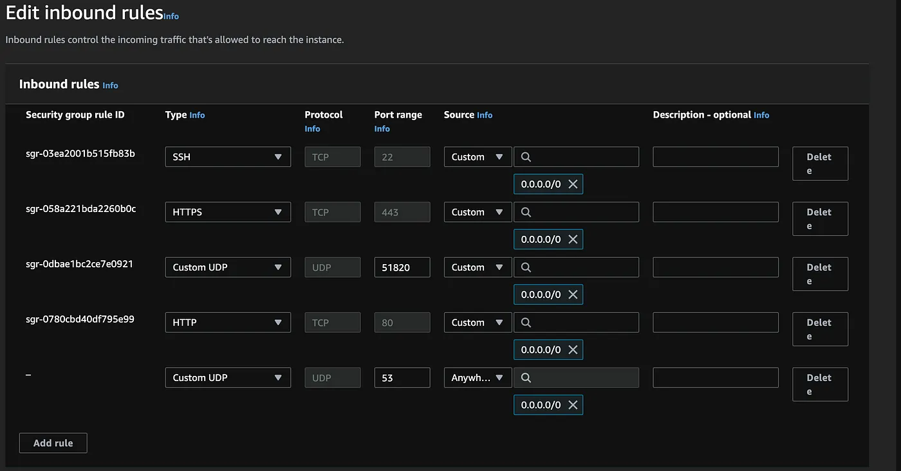

# WireGuard Ansible VPN

This project automates the installation and configuration of a WireGuard VPN using Ansible. The playbook helps set up WireGuard on target servers with minimal manual intervention.

## Prerequisites

Before using this project, ensure that the following prerequisites are met:

1. **Python 3.6+** is installed on the control machine.
2. **Ansible** is installed on the control machine.
3. **SSH access** to the target hosts is properly configured.

)

## Project Setup

### 1. Clone the Repository

Start by cloning the repository to your local machine:

```
git clone https://github.com/your-username/wireguard-ansible-vpn.git
cd wireguard-ansible-vpn
```

### 2. Create a Python Virtual Environment

It's recommended to create a Python virtual environment to isolate dependencies:

```
python3 -m venv venv
```

Activate the virtual environment:

- On Linux/macOS:
    ```
    source venv/bin/activate
    ```
- On Windows:
    ```
    .\venv\Scripts\activate
    ```

### 3. Install Required Dependencies

Install the dependencies defined in the \`requirements.txt\` file:

```
pip install -r requirements.txt
```

### 4. Configure Inventory

You'll need to configure the inventory file to match the target servers where WireGuard should be deployed.

1. Rename the example inventory file:
    
    ```
    mv inventory.ini.bkp inventory.ini
    ```

2. Edit \`inventory.ini\` to include the target servers. Here's an example of the inventory file format:

    ```
   [myhosts]
   <ip-address> ansible_user=ubuntu ansible_ssh_private_key_file=<ssh key pem file path>
    ```

- Replace \`server1\`, \`server2\`, and their respective IP addresses with the actual hosts you want to configure WireGuard on.
- Ensure that the \`ansible_user\` is set to a user with sufficient privileges to install packages and configure services.

### 5. Customize the Playbook

Before running the playbook, you may want to customize the WireGuard settings in \`playbook.yaml\`. This could include defining the interface name, port, and other relevant settings based on your specific network configuration.

### 6. Run the Ansible Playbook

Once the inventory file is set and any desired customizations have been made, run the Ansible playbook with the following command:

```
ansible-playbook -i inventory.ini playbook.yaml
```

### 7. Verifying the Installation

After the playbook completes, verify that WireGuard has been installed and is running on the target servers:

```
systemctl status wg-quick@wg0
```

If everything is correct, the service should be active and running.

